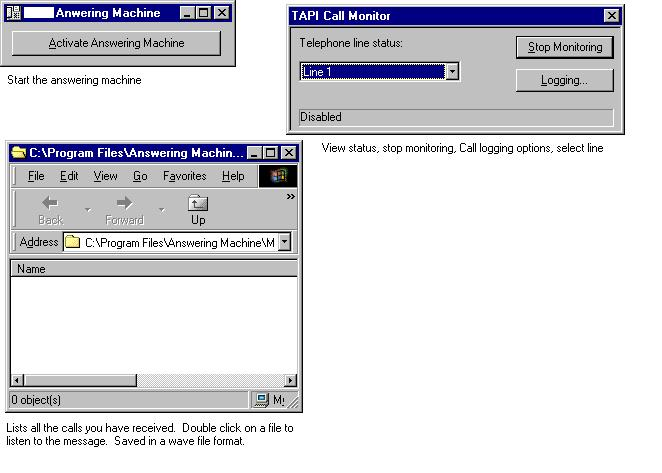

## AnswerIT\(VoiceMail\) \(ReSubmit\)

### Description

Voice Mail, answering machine using Microsoft Telephony which installed as a part of the MS Speech SDK. This submission has the xtell.dll i left out before.
 
### More Info
 
If you can't get this program to work, try installing vb service pack 4, and MS Speech SDK. That should get it to work for you. If not reintsall sp4. If that still don't work email me.

             |
---                |---
**Submitted On**   |2000-07-31 01:27:00
**By**             |[CJNLENNY\.COM](https://github.com/Planet-Source-Code/PSCIndex/blob/master/ByAuthor/cjnlenny-com.md)
**Level**          |Intermediate
**User Rating**    |3.2 (19 globes from 6 users)
**Compatibility**  |VB 6\.0
**Category**       |[Miscellaneous](https://github.com/Planet-Source-Code/PSCIndex/blob/master/ByCategory/miscellaneous__1-1.md)
**World**          |[Visual Basic](https://github.com/Planet-Source-Code/PSCIndex/blob/master/ByWorld/visual-basic.md)
**Archive File**   |[CODE\_UPLOAD8512822000\.zip](https://github.com/Planet-Source-Code/cjnlenny-com-answerit-voicemail-resubmit__1-10317/archive/master.zip)

